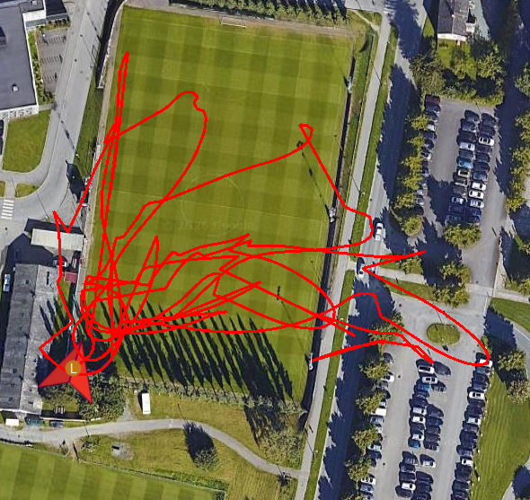
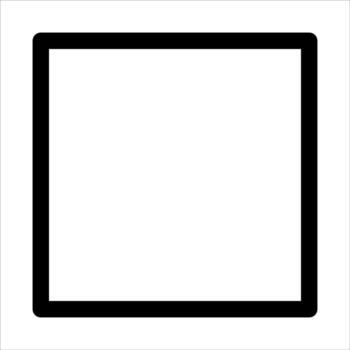
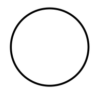
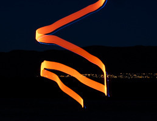

# autonomy27-startup

Vi skal tegne i [QGroundControl](https://docs.qgroundcontrol.com/Stable_V5.1/en/qgc-user-guide/getting_started/download_and_install.html)




## ROS 2 workspace

```bash
source /opt/ros/jazzy/setup.bash
```
bygg ved å kjøre 
```bash
colcon build 
```
then source workspace 
```bash
source install/setup.bash
```
run the code

```bash
ros2 run package_name node_name
```

# selve oppgaven
Målet er å bli kjent med flere verktøy vi kommer til å bruke i løpet av året. 

lage et program som gjør at en drone kan:
- lette
- fly i et mønster bestemt av oss
- lande 
autonomt 

### former

#### firkant 




#### sirkel


#### hjerte 


#### ascend



## steg

1. designe FSM/BT veldig enkelt design jeg ville gått for FSM
2. lage koden
3. ut og fly lære logging osv


# Læringsmål
- ROS2 
- PX4
- Qgroundcontrol
- 

